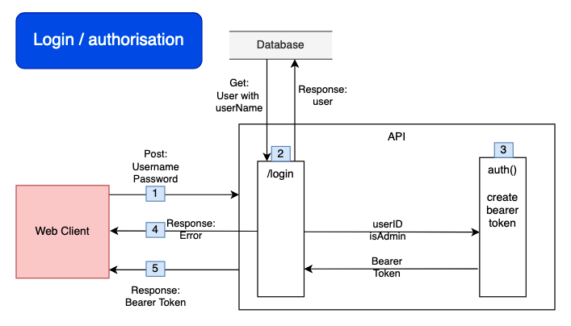
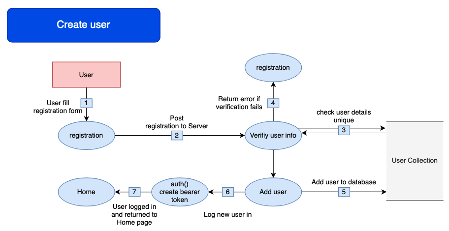
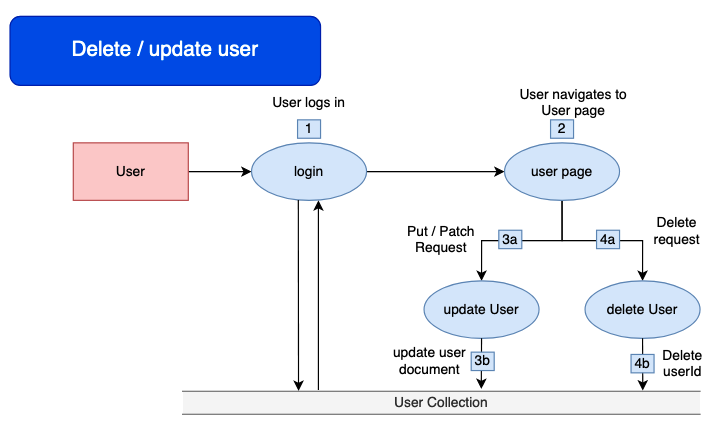
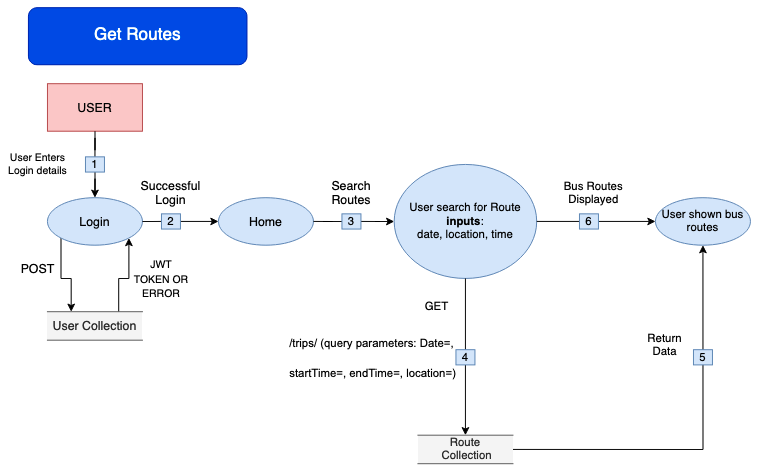
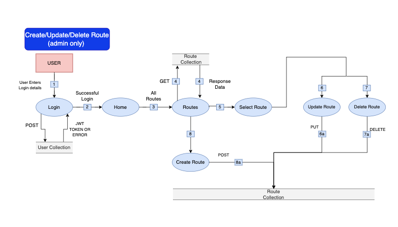
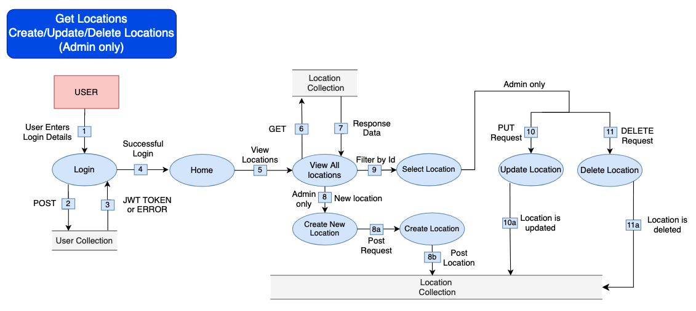
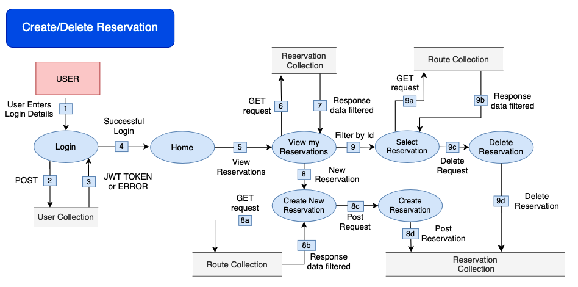
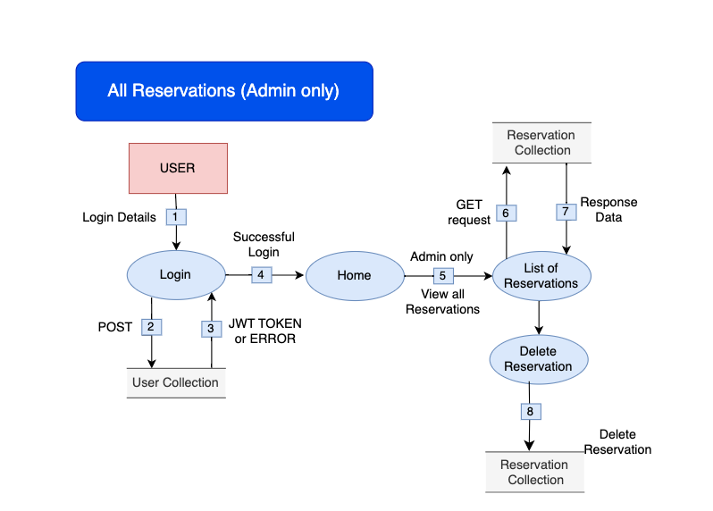

# T3A2 - Full Stack App (Part B)

# R10 Deployment links
[Production Website - https://torchexpress.netlify.app/](https://torchexpress.netlify.app/)

[Deployed API - https://t3a2b-torch-express-api.onrender.com](https://t3a2b-torch-express-api.onrender.com)

## Deployment credentials
### Admin
email: admin@example.com
password: admin1234

### User
email: user@example.com
password: 123456

# R11 GitHub Repos
[T3A2-A Repo](https://github.com/dtbooy/T3A2A)
[T3A2-B Backend Repo](https://github.com/dtbooy/T3A2B-Torch-Express-API)
[T3A2-B Frontend Repo](https://github.com/dtbooy/T3A2B-Torch-Express-Front-End)

# Other Document links
[Manual integration test document (Google doc)](https://docs.google.com/document/d/1-OH11vcpysQHJBcWNGXAWlOwStB04-EWAIszu_B7AHs/edit?usp=drive_link)
[Our Trello Board](https://trello.com/b/eErgaOOb/t3a2-team-board)

# Development Team 
|  |  |
|------------|---------------------|
| Dirk Booy| [GitHub Profile](https://github.com/dtbooy)| 
| Derdriu McAteer| [GitHub Profile](https://github.com/derdriu-mcateer)| 
| Max Handley | [GitHub Profile](https://github.com/maxhandley97) |

# R12 Full Stack App - Part A README.md
# R1 	Website Description

## Purpose
Our client, Client X is the proprietor of a shuttle bus company and has secured a grant to provide public shuttle service for the Brisbane 2032 Olympics. Client X has requested the development of a full stack web application which will streamline the process of securing a ticket for a shuttle service. This web application will allow users to view and book shuttle bus tickets to and from various venues across Brisbane, ensuring smooth and efficient transportation throughout the duration of the Olympics.

While traditional methods of booking shuttle bus tickets often involve long queues or phone calls, which can be time-consuming and inconvenient for users, our web application offers a more convenient and efficient way for users to book their tickets, saving them time and effort. Users will be able to access the booking system from anywhere with an internet connection, whether it's from their home, office, or on the go. This accessibility makes it easier for users to plan their transportation needs and book tickets at their convenience. Our web application can provide real-time updates on shuttle bus schedules, availability of seats, and any changes or delays. This ensures that users have accurate information at their fingertips and can make informed decisions when booking their tickets.

Client X has specified that they will be providing services to three main event venues: Brisbane Cricket Ground, Brisbane Arena and Brisbane Football Stadium. They have also specified four locations in Brisbane they will be providing the pick up and drop off services: Eagle Farm, Queen Street Mall Bus Station, Toowong and Southbank. Client X desires a scalable application architecture that seamlessly accommodates the addition of new locations, routes and admin users. This flexibility ensures that the application can efficiently scale to meet evolving business needs, allowing for the effortless integration of additional services as required.

## Functionality / features

### Login and Registration functionality 
Users have the capability to register to the app by using their email address and a secure password. Robust authentication procedures ensure the confidentiality and security of user accounts. Users have the ability to log in to the application using their email and selected password. 
### Search Bar feature
The application features a search bar which allows a user to search for a bus route based on four criteria starting location, end location, date and time. Upon searching the application navigates the user to an information page showing information based on their search criteria.
### Functionality to reserve a ticket 
Users have the ability to reserve a ticket for a selected bus route. They also have the ability to select multiple tickets for a selected route. 
### Navigation Bar feature
The application provides a user friendly interface that allows users to easily navigate across the web pages. It features a navigation bar which allows users to navigate to the home page, their user profile and their reservations.
### Reservations 
The application allows users to view their current reservations for bus routes. It also allows a user to update or delete their current reservations. 
### Locations 
Admin users have the capability to create new locations for pick up and drop off. They also have the ability to update and delete current locations in the application. 
### User Profile
All users have the ability to view their personal information within their profile. This profile allows the user to edit their information as well as delete their account should they wish.

## Target audience
The application is targeted towards members of the general public who will be attending events at the Brisbane 2032 Olympics. The web application is strategically designed to cater to a diverse audience with varying needs and preferences. It is accessible and user friendly for individuals of all backgrounds and abilities. Whether the user is a Brisbane resident, an international visitor, an athlete or an official/volunteer, the web application ensures an intuitive navigation to ensure seamless access to the free shuttle bus service. 

## Tech stack
### MongoDB 
MongoDB is a NoSQL database management system which stores data in a flexible JSON-like format
### Express.js
Express.js is a web application framework which provides tools for creating and handling routes and managing HTTP requests. 
### React
React is a JavaScript library which provides a framework for building dynamic user interfaces with reusable components. 
### Node.js
Node.js is a runtime environment which allows for the execution of JavaScript code on the server side

### Libraries 
#### bcrypt
Used for hashing passwords and comparing hashed passwords in Node.js.
#### cors
Used to enable Cross-Origin Resource Sharing (CORS).
#### dotenv
Used to load environment variables from a .env file into process.env.
#### express
Used as the web framework.
#### jsonwebtoken
Used for creating, decoding, and verifying JWTs.
#### mongoose
Used as the An Object Data Modeling (ODM) library for MongoDB operations.
#### react
Used for building the front end / user interfaces.
#### bootstrap, react-bootstrap
Used as the CSS / styling framework.
#### js-cookies
Used for handling cookies.
#### jest
Used as the Testing framework - Dev dependency only.
#### supertest
Used as the testing library used for testing requests to the API - Dev dependency only .
#### Vitest and Testing-Library (@testing-library/jest-dom, @testing-library/react, @testing-library/user-event)
Used as the testing library for the front end - Dev dependency only.

### Third Party Applications
- **MongoDB Atlas** - cloud database service used for Mongo NoSQL database deployment 
- **Render** - cloud-based software used for backend deployment 
- **Netlify** - platform that provides hosting and deployment services, used for front end deployment
- **GitHub & Git** : version control 
- **Trello**: project management tool 
- **Draw.io**: used as a design tool to develop DFDs and wireframes 

# R2 	Dataflow Diagrams

1. User fills out login form, WebClient sends Post request to API with entered username & password
2. Login route:
   - Receives Post with request username and request password
   - Gets user document where username = request username from database
   - Compare password hashes, if match pass user document to auth() function
3. Create bearer token including:
   - exp: 1 hour
   - sub: user_id
   - isAdmin: isAdmin
4. If password hashes do not match an error is returned
   - Receives Post with request username and request password
   - Gets user document where username = request username from database
   - Compare password hashes, if match pass user document to auth()
3. Create bearer token including:
   - Receives Post with request username and request password
   - Gets user document where username = request username from database
   - Compare password hashes, if match pass user document to auth()
3. Create bearer token including:
   - exp: 1 hour
   - sub: user_id
   - isAdmin: isAdmin
4. If password hashes do not match an Error is returned
5. If password hashes match bearer token is return

1. User fills in registration form
2. Post request to API with registration information
3. Verify input info - check database for existing email / username
4. If verification fails - return an error message and display on registration page
5. On passing verification add user to database
6. Log in new user - Call auth() function (creates bearer token)
7. Return bearer token, user view is redirected to home page (now logged in)

1. User logs in
2. User navigates to user information page
3. User updates details:
   - Patch request sent to API 
   - Updated information is verified and user document is updated in database
4. User requests deletion of account:
   - Delete request sent to API 
   - User document is deleted from database

1. User signs in
2. Upon successful login the user is taken to the home screen
3. User searches for a bus route by providing three inputs: date, location and time  
4. Upon searching a get request is sent to the db to receive the appropriate routes in the route collection 
5. The selected routes are returned to be displayed
6. The user is displayed the appropriate bus routes based on their search parameters 

1. Admin signs in
2. Upon successful login, admin is taken to the home screen
3. Admin navigates to all routes page
4. List of all routes are returned and displayed to the user based on their search criteria
5. Admin selects a route from the available routes and can proceed to update or delete route 
6. Admin can select to update route details
   - Sends a PUT request to the route collection 
7. Admin can select to delete a route 
   - Sends a DELETE request to the route collection 
8. Admin can select to create a new route 
   - Sends a POST request to the route collection

1. User signs in  
2. Post request to User collection  
3. JWT or Error response
4. User sent to homepage
5. User is sent to a list of Locations
6. Get request sent to Locations collection
7. Server sends response data
8. If admin, new location available
   - Admin is able to create new location with Post request
   - New location is posted
9. User can select a singular location for more information
10. If admin user, update location is available
   - If admin edits a route, a PUT request is sent to API
   - Updated information is verified and Location document is updated in the database
11. If admin user, delete location is available
   - If admin selects delete location, a delete request sent to API
   - Location document is deleted from the database

1. User signs in  
2. Post request to User collection  
3. JWT or Error response
4. User sent to homepage
5. When User clicks “My Reservations” 
6. A get request is sent to the Reservations collections and
7. Reservations are filtered by User_Id and presented.
8. User selects create new reservation
   - A get request is sent to the route collection
   - Responds with data on available routes
   - Once selected, a post request is sent to API
   - User Reservation is created
9. User selects to view singular reservation
   - Get request is sent to the route collection
   - Responds with more data on the selected route
   - When delete reservation is selected a delete request is sent to the API
   - Reservations document is deleted from the database

1. User signs in  
2. Post request to User collection  
3. JWT or Error response
4. User sent to homepage
5. If Admin, option to view all reservations
6. A get request is sent to Reservation Collection 
7. Response data lists all the reservations
9. Admin can select to delete reservation from the reservation collection

&nbsp;

# R3 	Application Architecture Diagram

Users access the web app through a variety of different devices. Front end / client side renders the views and handles the user interactions. It will request data from the back end through API calls, and dynamically render the webpages based on the API response data. The Back end receives requests from the front end and applies application logic and will send requests to the database. The database receives queries from the backend and returns stores the requested data.

# R4 	User Stories
User stories are a fundamental component of agile software development methodologies, providing a structured approach to understanding and prioritising user needs. We utilised our user stories to help define the scope of the features and functionalities. We decided to do user stories for a standard user and for an admin user - to ensure we covered all aspects of the web application. We found that placing an importance on each story helped us in making informed decisions about what to develop. After developing our dataflow diagrams we went back for a second iteration and refined a few of the user stories, as well as rejected stories that we believed weren't MVP, however these rejected stories will be reconsidered later depending on timeframes. Upon developing the wireframes we then revised the user stories a third time and refined any that needed changes. 

| User Story | Acceptance Criteria | Importance | Accept/Reject | Version |
|------------|---------------------|:------------:|:---------------:|:---------:|
| As an end user, I want to be able to search through available shuttle services so that I can easily find ones I am interested in | Given that I am logged in as an end user when I am viewing the available shuttle services then I can have the ability to search/filter for services based on selected criteria | HIGH | Accept | 1 |
| As an end user I want to be able to reserve a ticket online so that I know I am guaranteed a spot | Given that I am signed into my account when I book a ticket then I receive confirmation (ticket) | MEDIUM | Accept | 1 |
| As an end user I want to be able to see the reservations I have made so that I can come back later and check the details of my trip | Given that I am signed into my account when I have booked a ticket then the booking will appear in My Trips | HIGH | Accept | 1 |
| As an end user I want to be able to select the language the web page is displayed in | Given that I speak another language when I am viewing a web page then I have the ability to toggle between different languages | LOW | Reject | 2 |
| As an end user I want to be able sign-up/login in so that I don’t have to enter my details every time I book | Given that I have signed up for an account, when I enter my details in correctly on the login screen then I should receive confirmation of login and be able to access the user functions | HIGH | Accept | 1 |
| As an end user I want to be able to update my details | Given that I am signed in, when I navigate to my user profile then I can update my details | HIGH | Accept | 2 |
| As an end user I want to be able to see a map of all the locations | Given than I am viewing the web site when I am viewing details about the pickup and drop off locations then I can view them in a map format | MEDIUM | Reject | 2 |
| As an end user I want to be able to delete my account | Given I have an account, when I delete my account, then I don’t have an account | HIGH | Accept | 2 |
| As and end user with limited proficiency in technology I want to be able to have a simple to navigate user interface | Given that I have a low proficiency with technology, when I am anywhere on the website then there is a clear navigational menu, which also indicates where I am | MEDIUM | Accept | 2 |
| As an end user with dependents I want to be able to reserve multiple tickets | Given I am signed in, when I am booking tickets then I can select how many tickets I want to book | HIGH | Accept | 2 |
| As an admin user I want to be able to easily add new services so that I can offer more services to my users | Given that I am logged in as an admin user when I navigate to ‘All Routes’ then I should see an option to ‘Add a New Route’ | HIGH | Accept | 2 |
| As an admin user I want to be able to edit existing services to update details so that these updated details are displayed to the user | Given that I am logged in as an admin user when I navigate to the ‘All Bus Routes’ then I should see a list of all existing bus routes with an option to edit each service | HIGH | Accept | 2 |
| As an admin I want to be able to get a list of reserved tickets for each service so that for each service I can see who has reserved. | Given that I am logged in as an admin user when viewing all reservations I have the ability to filter based on selected criteria (eg. Bus Route) | HIGH | Accept | 2 |
| As an admin I want to be able to delete user reservations so that if a user contacts me to delete their reservation I can. | Given that I am logged in as an admin user when viewing the list of reservations for a service then I can delete single reservations | HIGH | Accept | 3 |
| As an admin I want to be able to delete services and all reserved tickets so that if the service is no longer displayed. | Given that I am logged in as an admin user when I navigate to the ‘All Bus Routes’ then I should see a list of all existing bus routes with an option to delete a single service (deleting all reservations within that service as well) | HIGH | Accept | 2 |
| As an admin I want to be able to delete user accounts so that if a user contact’s me to delete their account I can. | Given that I am logged in as an admin user when viewing a list of all users then I can delete a individual user’s account | MEDIUM | Accept | 2 |
| As an admin I want to be able to grant admin privileges so that if my business grows I can add more admins | Given that I am logged in as an admin user when viewing a list of all users then I can grant admin privileges to individual users | MEDIUM | Accept | 2 |

# R5 	Wireframes for multiple standard screen sizes
## Landing page
 

## Sign in page

## Register a new user page

## Trip search and result page

## Book a trip page

## Plan your trip page

## My Trips page

## User profile page

## All routes page (Admin Only)

## Create a new route page (Admin Only)

## Edit a route page (Admin Only)

## All users page (Admin Only)

## All reservations page (Admin Only)

## All locations (Admin Only)

# R6 	Trello Board Screenshots 
[Our Trello Board](https://trello.com/b/eErgaOOb/t3a2-team-board)

# R13 	Trello Board Screenshots - Part B

